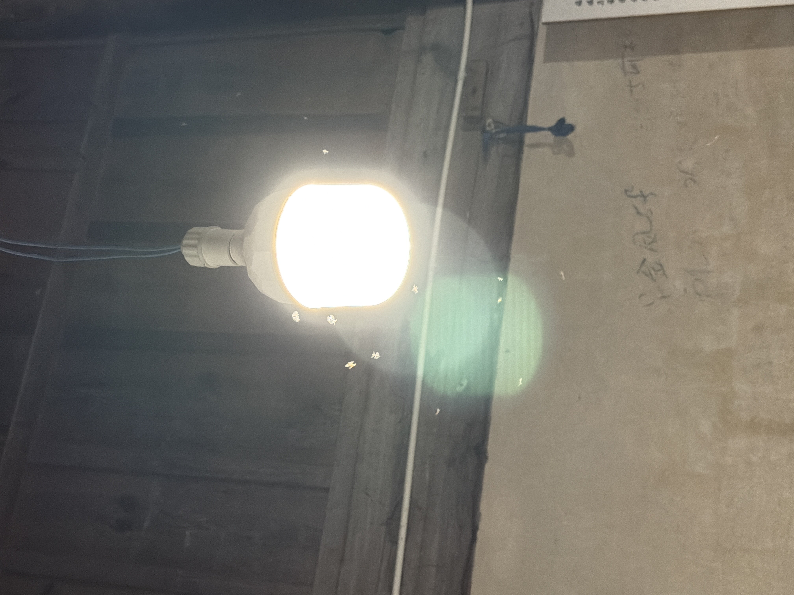
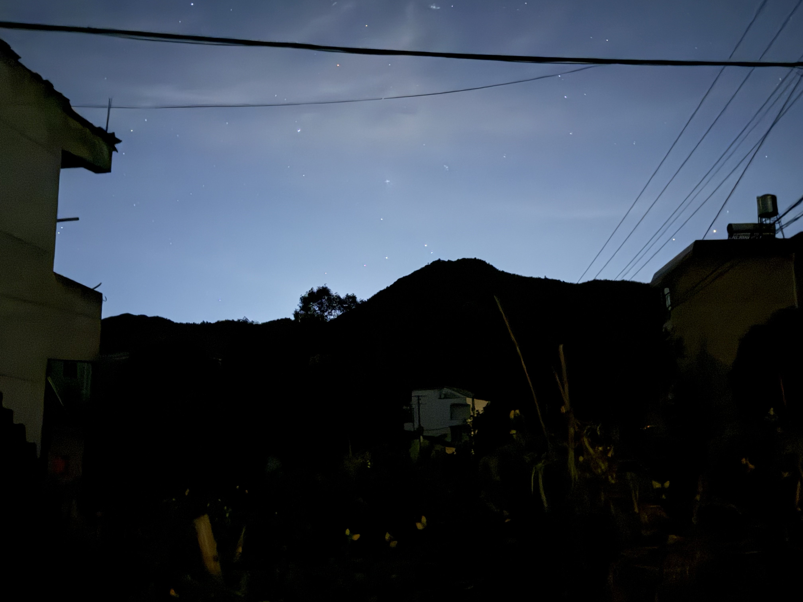
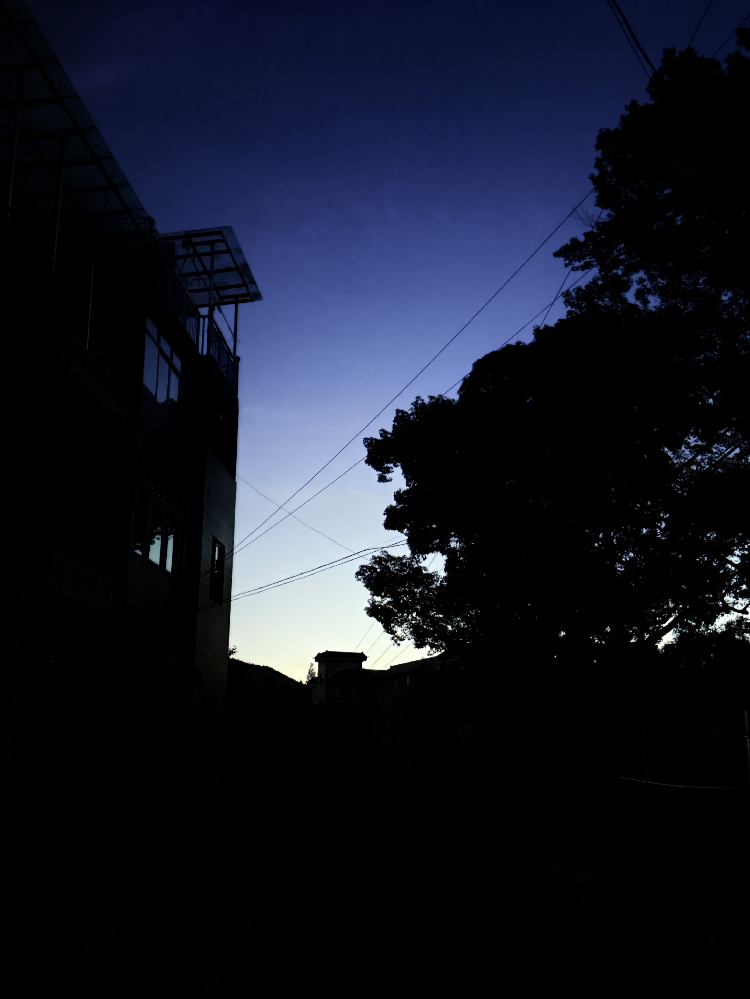
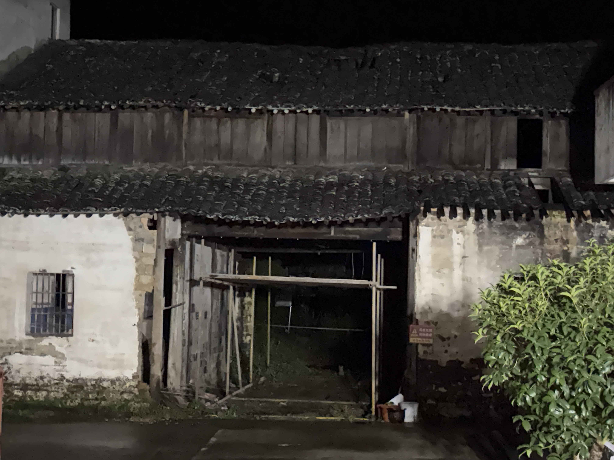
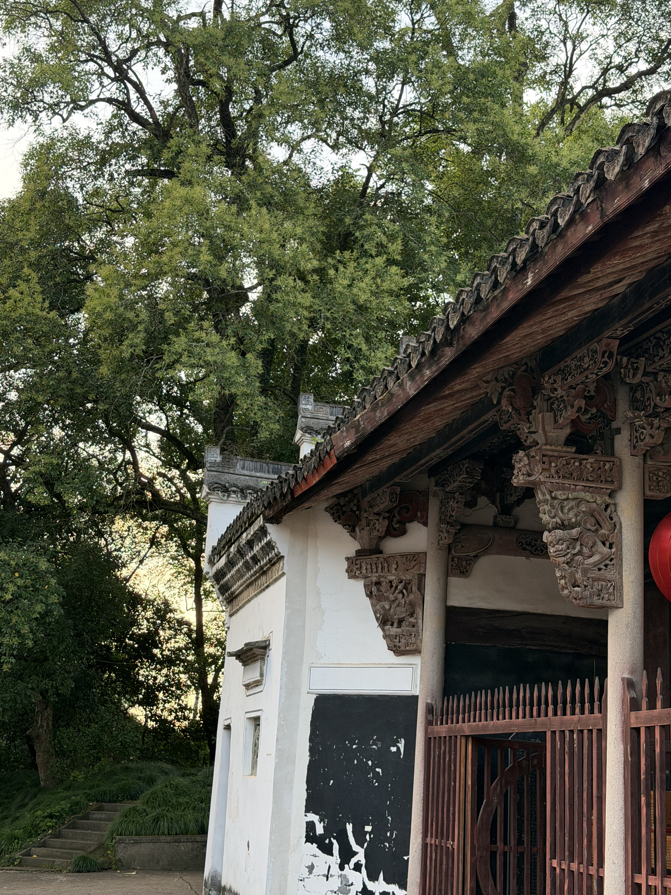

+++

title = "26.8.16"

summary = ""

date = 2026-09-08T18:39:23+08:00

lastmod = 2026-09-08T18:39:23+08:00

categories = []

tags = []

comments = true

ShowToc = true

TocOpen = true

draft = false

+++
# 8.16  
午夜2:22  
于乡下  
   飞蝇在灯泡旁飞转着，打灭了一批又渐渐聚起来一批。  

  坐在香火堂前，在死的边界，却感到了许久未体会到的夏夜。夏虫彻夜鸣唱，刚下过倾盆雨的水泥地上散发出一阵潮湿的气息。可惜的是厚厚的云层仍未散去，遮掩了上面的繁星点点。  
  
  
  
  
（上次夜半的群星与黎明的蓝天）  
   堂前是年久失修的老屋，已经被警示带围了起来，写着“危房勿近”。青砖黛瓦，被雨季的霉点爬上了半墙，却是难得能看出半点江南的水色。  
  

（老屋。）  
香火堂里弥漫着香火的气息与时代的踪迹。它诞生在百年前的时代，留下了新中国初期独特的记录。藏在时代错落的小筑中，它的威严是由文化与氛围赋予的，远非后来建造起来的祠堂可比。堂门吱嘎关上，砰地相靠，门锁哐蹚一声锁上，那一刻你感受到的是突然的永别：无感的一切在这时突然被无限地强调，你与门后的那张肖像已是永隔。  
  
（王谢堂前）  
 乡土中国是繁杂的，它是美的，是纷扰的，也是落后的。浅看有绿水满陂塘，翠岭绵延，有日式的水库堤坝。但是当你深入其中，就会发现这里有无数的人情缠绕，有无数的勾心斗角，也有无数的人心不一。它让人爱其中的人，也让人厌恶其中的人。它终究会被城市或者新农村取代，乡土只会在时间的淡忘中被理想化，成为一个记忆符号被记忆，而不是作为一个真正的乡土被铭记。  
 那我为什么会对外婆家的印象是美好呢？大概是和蔼的外婆，与高高在上的地理位置，让它有人情的美好，但无世故的纷繁。  

