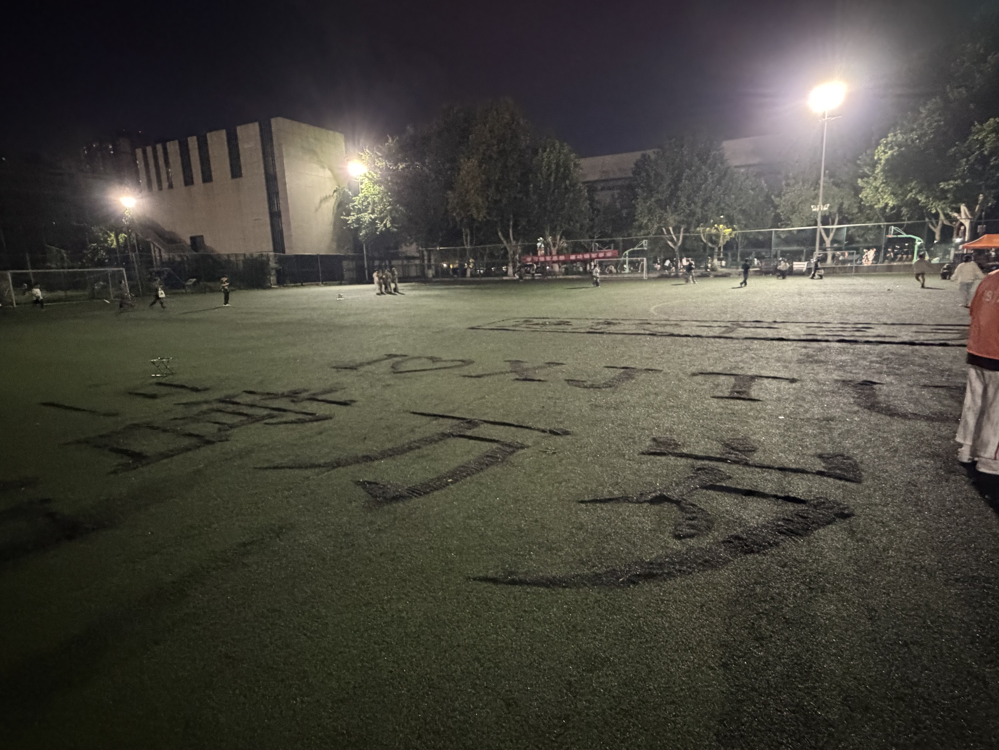

+++

title = "军训纪实Ⅲ"

summary = "军训结束了，我也该写一个总结了。"

date = 2026-09-14T13:08:39+08:00

lastmod = 2026-09-14T13:08:39+08:00

categories = ['西交生活']

tags = ['军训','西交','连续剧']

comments = true

ShowToc = true

TocOpen = true

draft = false

+++

军训在2天前已经结束了，但是直到今天才想起来并有时间去写一个总结（

除了刚开始的一周是晴天，之后都是阴天或者雨天，呆在教室里和宿舍里，舒服~实在要去训练的，也热不到哪里去，凉凉爽爽地就过去了。（就是早操的时候是真的冷……）

来到西安才发现原来在夏天树荫底下与太阳底下体感温度可以差许多的，之前在浙江一直都是一视同仁的热。

教官也很好，训的确实严，但放松的时候也很松。好评！！（最后还恰了个v
（鉴于某二字教官的发言，就不给他挂网上了😀）

最后一个晚上的气氛也很好，~~就是我在的连基本都在玩手机。~~

无论怎样，军训都已经结束了，接下来是我正式开始的大学生活！

Enjoy：）