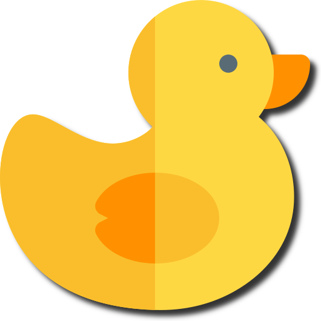

+++

title = "有用的网站/软件"

summary = "收集了一些好的网站（后面扩展到软件），贴在这里。"

date = 2026-09-17T16:23:00+08:00

lastmod = 2026-09-17T16:23:00+08:00

categories = ['好的东西就要分享']

tags = ['网站','效率','学习']

comments = true

ShowToc = true

TocOpen = true

draft = false

+++
# Websites
## 学习相关
### ExamCrafts
https://examcrafts.com/

学习英语（主要），也可以学其他东西。

### Luogu（洛谷）
https://www.luogu.com.cn/

练习编程，oier的天堂。残存着我六年级时候的记忆，有点怀念。

### 菜鸟教程
https://www.runoob.com/

各类编程语言学习的地方。好用，适合略有基础的初学者一边做题一边翻。

## 游戏

### Steam
https://store.steampowered.com/

给小白的，不要进错网址了。其他的无需多说。
### 游戏避难所
https://www.flysheep6.com/

一个下盗版游戏的地方。大多数是种子，也有直传（要先注册飞猫盘）。只推荐种子下载。

### PlayZip
https://playzip.com/

一个下盗版游戏的地方，提供直链。好网站。

单机派
https://www.danjipai.com/

也是一个下盗版的网站。提供国内外的网盘，也有直链。

## 漫画，Gal

### Kmoe
https://kzo.moe/

漫画下载。要注册，一般用户下载有限量。还挺好用的。

### 次元狗
https://www.acgndog.com/

可能需要翻墙。多为夸克资源。有小说漫画动画Gal各类资源。

### 鲲Gal
https://www.kungal.com/

国内相对最完善，最大的Gal下载站和论坛。

### singureo
https://www.singureo.com/

好用，直链下载Gal。页面美观，分类清晰。但是兄弟你怎么似了😭（2026.9.17 17：25）

# Apps

>  注意！本条目未标注的软件默认皆为ios端，可从appstore国区下载，非国区/Android端会标注出来。
## 学习相关
### 有课么（有Android端，没用过）
https://youkeme.com/

课表。免费无广，支持AI识别导入，免费版一学期（还是一年？）六次，普通人肯定是够了，没必要买Pro，当然可以买一个支持一下作者。反馈了之后作者回复也很勤快。夯。
### ChatGPT（美区）
我说ChatGPT老师夯爆了！AI老师才是最好的老师有没有懂的（

## 轻小说漫画动漫
### 图书
自带软件，适合看epub的图书。
### 漫阅

基础版3 rmb，不推荐进阶版。venera改的，可以找到github项目。可以导入漫画源，算Appstore里为数不多的可以导入漫画源的了。
### 可达阅读器

https://keda.fun/

完整版68 rmb。本地漫画。好用。（有一个漫画胶囊的软件，生态位几乎重合，而且页面不如这款软件，就是更新比较勤快。）
### ZeroReader

1 rmb完整版。夯爆了。清爽无广，丝滑流畅。就是只能看txt，epub格式也只能看文本。推荐搭配自带的图书使用。

## 游戏
### Slay the Spire（美区）

＄9.99
杀戮尖塔，卡牌肉鸽，伟大无需多言。

东尼意思🫥。小贵。

### XP3player

58 rmb买断。你懂的，我是旮旯Game大神😎

### Arkrpg

https://arkrpg.tech/

98 rmb买断。软件设计可以，就是太贵了,性价比极低。