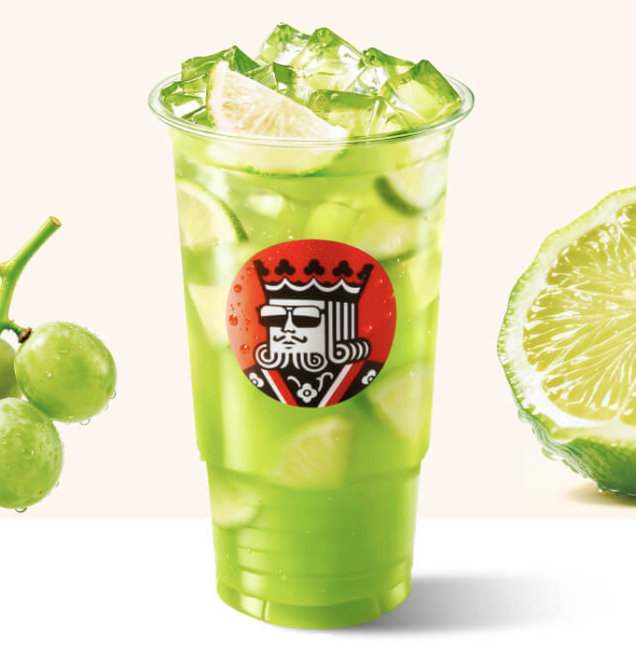
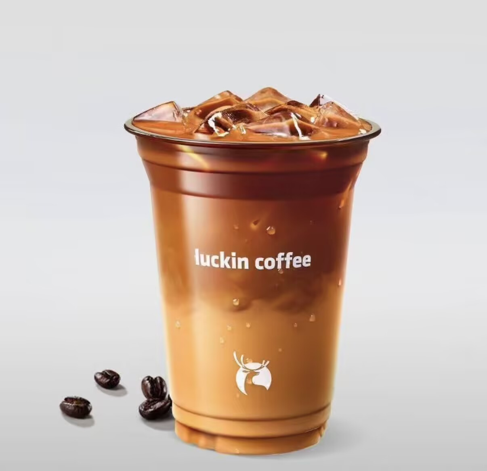

+++

title = "下交外卖"

summary = ""

date = 2026-09-06T18:09:39+08:00

lastmod = 2026-09-06T18:09:39+08:00

categories = ['食在西交']

tags = ['进食','西交','食在西交','外卖']

comments = true

ShowToc = true

TocOpen = true

draft = false

+++
## 饮品

幸运咖：
青柠冰茶⭐⭐⭐：一般，有味道，超大杯团购券用完6.5 rmb/杯，勉强可以接受。但是东南门外那家糖浆混合不均，第一口插到底部的话会很齁。（在家里的蜜雪冰城的柠檬水也会有这样子的现象）

瑞幸：
埃塞金烘拿铁⭐⭐⭐⭐：好喝。配置：热 少糖

小黄油拿铁⭐⭐⭐⭐：可以，就是会有跟幸运咖-青柠冰茶一样的问题，糖没有拌匀。
