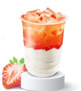
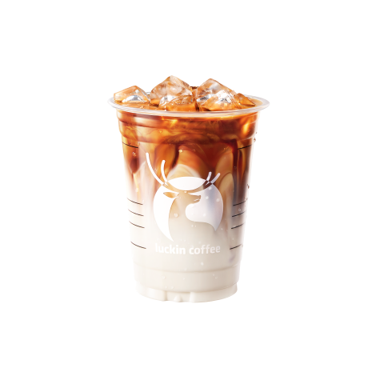
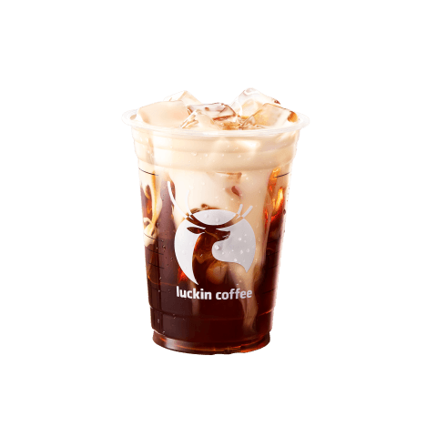
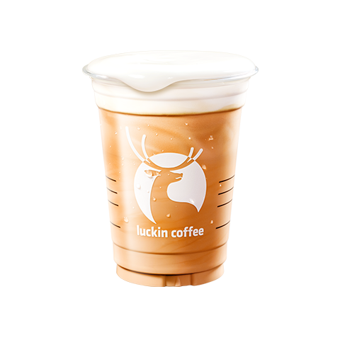

+++

title = "下交外卖"

summary = "对外卖/堂食的测评（仅限于自己点过的），财力精力有限，有没踩到的坑（还是少踩点吧）或者没体验到的物美价廉的店请不要做一些不文明行为，不要把我挂网上（bushi）"

date = 2026-09-06T18:09:39+08:00

lastmod = 2026-09-06T18:09:39+08:00

categories = ['食在西交']

tags = ['进食','西交','食在西交','外卖']

comments = true

ShowToc = true

TocOpen = true

draft = false

+++
# 饮品

本人只是个普通人，不了解咖啡相关圈子，也不懂相关知识，评判仅以口味与个人意见为准，有极强的主观性，不喜勿看。

## 蜜雪冰城
### 草莓摇摇奶昔⭐⭐⭐⭐
人上人！团购买可以压到3rmb/个。3 rmb的冰淇凌我还说啥呢，我买根冰棍都快要3 rmb了（

## 幸运咖
### 青柠冰茶⭐⭐⭐
一般，有味道，超大杯团购券用完6.5 rmb/杯，勉强可以接受。但是东南门外那家糖浆混合不均，第一口插到底部的话会很齁。（在家里的蜜雪冰城的柠檬水也会有这样子的现象）

## 瑞幸
### 拿铁
#### 埃塞金烘拿铁⭐⭐⭐⭐⭐
好喝，适合天冷的时候来一杯。口感就是我还是小屁孩的时候想象中的那种感觉，也算宴请小时候的自己了😎。

配置：热 少糖

#### 小黄油拿铁⭐⭐⭐⭐
可以，就是会有跟幸运咖-青柠冰茶一样的问题，糖没有拌匀。

### 美式
#### 小黄油美式⭐⭐⭐
一般，可以喝，但口感不如小黄油拿铁（废话）。健康之类的不在考虑范围内，所以拿铁完爆美式😋。

### 其他非咖啡类
#### 咸法酪泰奶⭐⭐
一般。团购7.9买的，喝起来就是很普通的奶茶的感觉。不是特别值，不如楼上的埃塞金烘拿铁。（感觉有点像香飘飘？不知道是不是我的忘记加奶盖了，感觉不到……）

### 冰茶冰奶
#### Hello 苹果茉莉⭐⭐⭐⭐⭐
豪喝😋！刚入口有很明显的茉莉花味和苹果味，口感清爽。有点惊艳到我了，必须五星好评！（就是写的时候已经入秋，马上就不适合喝了😭要趁着还有赶紧体验完（bushi））
